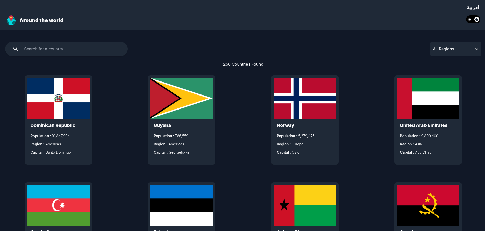

# Around the World

A modern, interactive web application to explore information about countries worldwide. The app supports both Arabic and English languages and features a responsive, dark/light theme.



## Features

- **Browse Countries:** View all countries with search and filter by region/continent.
- **Country Details:** Click a country to see detailed info: native name, population, capital, currencies, languages, and more.
- **Bilingual Support:** Easily switch between Arabic and English.
- **Dark/Light Mode:** Toggle between light and dark themes.
- **Local Storage:** Country data is cached locally for faster loading and reduced network usage.
- **Responsive Design:** Works seamlessly on all devices.

## Tech Stack

- [React](https://react.dev/)
- [React Router](https://reactrouter.com/)
- [Tailwind CSS](https://tailwindcss.com/)
- [react-i18next](https://react.i18next.com/) for translations
- [Vite](https://vitejs.dev/) for fast development and build

## Project Structure

```
src/
  App.jsx
  AppContext.jsx
  i18n.js
  index.css
  main.jsx
  assets/
    around-the-world.drawio
  components/
    CountryCard.jsx
    CountryList.jsx
    Header.jsx
    Logo.jsx
    NoResultFound.jsx
    RegionMenu.jsx
    SearchInput.jsx
    ShowMessage.jsx
    ThemeSwithcer.jsx
  pages/
    DetailsPage.jsx
    ErrorPage.jsx
    Home.jsx
    Layout.jsx
  utils/
    hooks/
      useLoadData.jsx
public/
  locales/
    ar/translation.json
    en/translation.json
```

## Getting Started

1. Install dependencies:
   ```
   npm install
   ```
2. Start the development server:
   ```
   npm run dev
   ```
3. Open your browser at the shown address (usually http://localhost:5173/around-the-world/
   ).

## Data Source

Country data is fetched from [REST Countries API](https://restcountries.com/).

## Contributing

Contributions and suggestions are welcome! Please open issues or pull requests.

---

© 2024 Around the World
